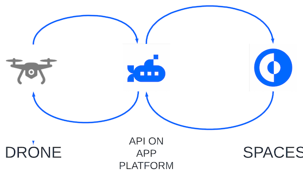
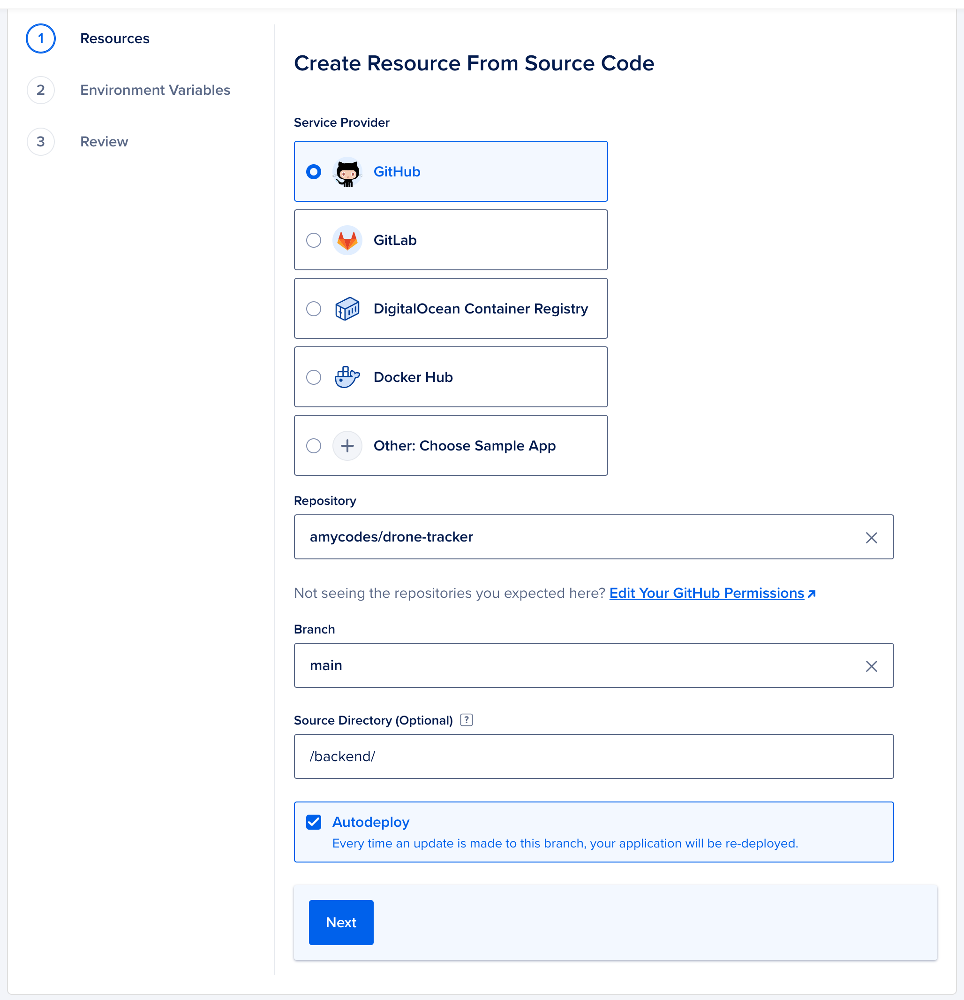
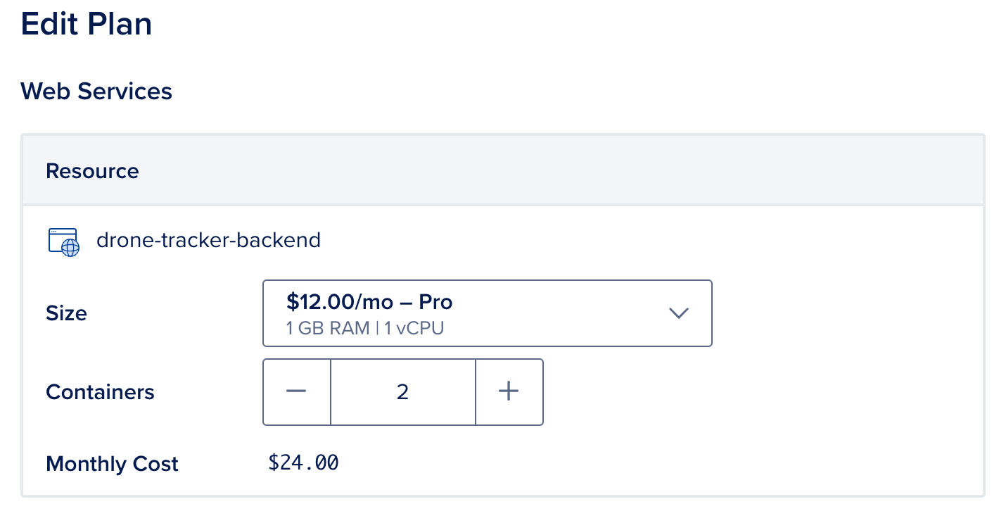

# drone-tracker



This simulates an application accessing a DigitalOcean Space with High Requests per Second. It recieves an http post request from a drone containing the drone id, timestamp, and geographical location. It then saves that data as a small file to the DigitalOcean Space.

## Deploy Instantly

This can be deployed on DigitalOcean's App Platform in minutes by selecting the GitHub repo from your available resources.

To connect your fork of this GitHub Repo to App Platform, click **Create** from the top of the your DigitalOcean account and select **Apps**.



The Resources page will allow you to choose from your available repos as well as the branch and the source directory. Select the `main` branch and `\backend\` as the source directory. Click **Next**. It will give you a preview of the resources. Beneath the list of resources, click **Edit Plan**. In order to best handle the large number of requests, choose the Pro Plan container with 1 vCPU with 1 GB Ram and set the number of containers to **10**. Click **Back** to return to the Resources. Click **Next**.



Now you can set **Environment Variables**. Set the variables below with your own credential details.

```
spaces_endpoint: {REGION}.digitaloceanspaces.com
spaces_key: {SPACES_ACCESS_KEY}
spaces_secret: {SPACES_ACCESS_SECRET}
spaces_bucket: {SPACES_BUCKET_NAME}
```

Click **Next**.

Finally, review the resources and click **Create Resources**.

## Run & Test Locally

The application is a single PHP script with the following prerequisites:

- PHP
- Composer
- Postman

To install the dependencies, enter `composer install` from the `\backend\` directory. To run the webserver, run `php -S localhost:8000 -t backend\`.

To post directly to the backend with Postman, copy the application endpoint for the POST request. Select **Body** from the request tabs and **form-data** as the type.
